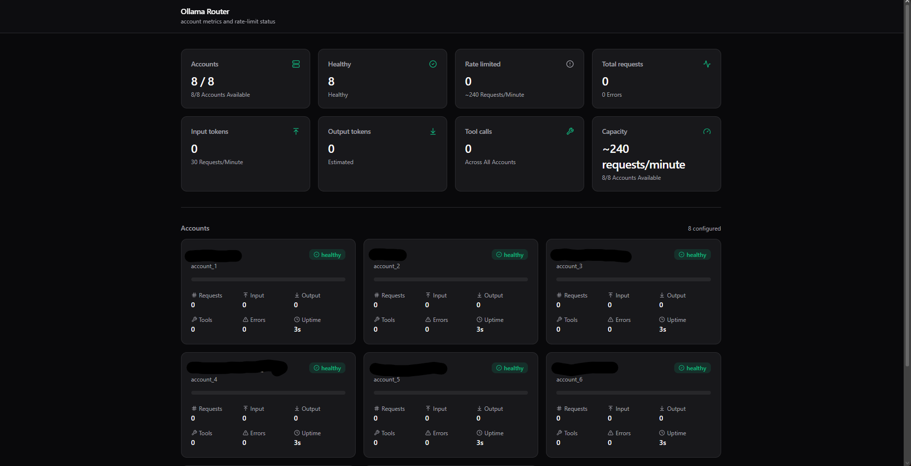

# Ollama Router

Multi-account router for Ollama Cloud. Aggregates several API keys, rotates on rate-limits, and exposes three API surfaces (Ollama-native, OpenAI-compatible, Anthropic-compatible) plus a live dashboard.



---

## Quick start

### 1. Add your API keys

Create `apikeys.txt` next to `compose.yml`, one Ollama Cloud key per line:

```
olm_key1...
olm_key2...
```

Get keys from <https://ollama.com/settings/keys>.

### 2. Start with Docker Compose

**Option A — pull the pre-built image from GitHub Container Registry:**

```yaml
# compose.yml
services:
  ollama-router:
    image: ghcr.io/pianonic/ollamarouter:latest
    container_name: ollama-router
    ports:
      - "8000:8000"
    volumes:
      - ./apikeys.txt:/app/apikeys.txt:ro
      - ./data:/app/data
    restart: unless-stopped
```

```bash
docker compose up -d
```

**Option B — build from source:**

```bash
git clone https://github.com/PianoNic/OllamaRouter.git
cd OllamaRouter
docker compose up -d --build
```

### 3. Open the dashboard

<http://localhost:8000>

---

## Endpoints

The router exposes the same surface as Ollama itself, the OpenAI REST shape, and Anthropic's Messages API. The Anthropic path is forwarded straight to Ollama's own `/v1/messages` (added in Ollama v0.14) — no translation in between.

| Surface              | Paths                                                                       |
| -------------------- | --------------------------------------------------------------------------- |
| Ollama-native        | `/api/chat`, `/api/generate`, `/api/tags`                                   |
| OpenAI-compatible    | `/v1/chat/completions`, `/v1/completions`, `/v1/embeddings`, `/v1/models`   |
| Anthropic-compatible | `/v1/messages`, `/v1/messages/count_tokens`                                 |
| Admin                | `/`, `/dashboard`, `/health`, `/metrics`, `/instances`, `/ws/dashboard`     |
| OpenAPI              | `/docs`, `/redoc`, `/openapi.json`                                          |

Full reference and code examples: [`USAGE.md`](USAGE.md), or the **Docs** tab in the dashboard.

---

## Clients

### Claude Code

Use one of the launcher scripts in `scripts/` — they set the env vars and forward all arguments to `claude`:

```bash
# macOS / Linux
./scripts/start-claude.sh

# Windows (PowerShell)
.\scripts\start-claude.ps1

# Windows (cmd)
scripts\start-claude.cmd
```

Override the router URL with `ROUTER_URL` if it isn't on `http://localhost:8000`.

Or set the env vars manually:

```bash
export ANTHROPIC_BASE_URL=http://localhost:8000
export ANTHROPIC_AUTH_TOKEN=anything
claude
```

### `ollama` CLI

```bash
export OLLAMA_HOST=http://localhost:8000
ollama run glm-4.7:cloud "hello"
```

### OpenAI SDK

```python
from openai import OpenAI

client = OpenAI(base_url="http://localhost:8000/v1", api_key="anything")
resp = client.chat.completions.create(
    model="glm-4.7:cloud",
    messages=[{"role": "user", "content": "hello"}],
)
```

---

## Configuration

Override via env vars in `compose.yml` (all optional):

| Var                           | Default            | Purpose                                          |
| ----------------------------- | ------------------ | ------------------------------------------------ |
| `DEFAULT_MODEL`               | `glm-4.7:cloud`    | Fallback when client sends a Claude model name   |
| `RATE_LIMIT_COOLDOWN_SECONDS` | `30`               | How long a rate-limited account stays out of rotation |
| `HTTP_TIMEOUT_SECONDS`        | `300`              | Upstream request timeout                         |
| `APIKEYS_FILE`                | `/app/apikeys.txt` | Path inside the container                        |
| `DATA_DIR`                    | `/app/data`        | Sqlite DB location                               |
| `SERVER_PORT`                 | `8000`             | uvicorn bind port                                |

---

## Updating

```bash
docker compose pull && docker compose up -d
```

## Stop

```bash
docker compose down
```
